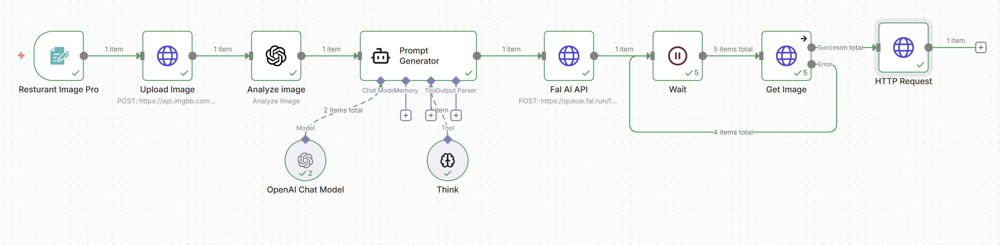
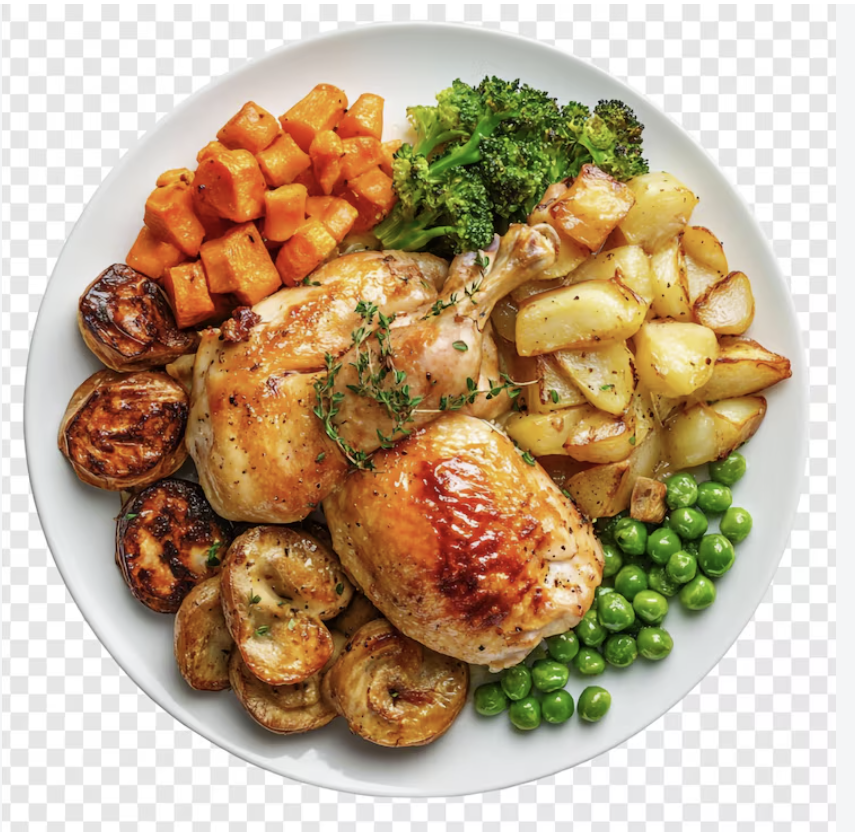
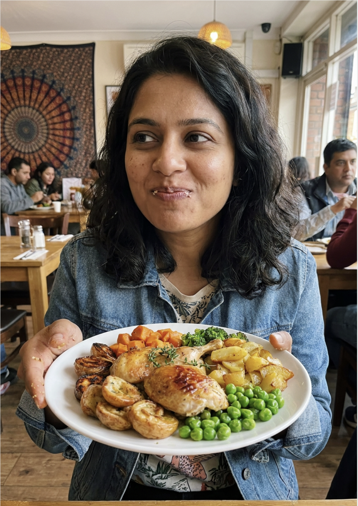

# n8n AI Food Scene Generator

I built this project to transform a simple food image into a more realistic lifestyle or restaurant-style image.

The workflow takes a food image as input, analyzes the dish, creates an AI prompt, and sends the prompt to an image-generation model. The final result places the food into a realistic scene with a person and restaurant environment.

## Workflow



The automation follows these main steps:

1. Receive the food image
2. Upload the image for processing
3. Analyze the food image using AI
4. Generate a detailed image-generation prompt
5. Send the prompt to the image-generation API
6. Wait for the image to finish generating
7. Retrieve the generated image
8. Return the final output

## How It Works

```text
Food Image
    |
    v
Upload Image
    |
    v
Analyze Image
    |
    v
Prompt Generator
    |
    +---- OpenAI Chat Model
    |
    +---- Think Tool
    |
    v
Image Generation API
    |
    v
Wait
    |
    v
Get Image
    |
    v
Final Generated Scene
```

## Example

### Input Food Image

The workflow starts with a standalone food image.



### Generated Output

The workflow analyzes the food image, creates a detailed prompt, and generates a realistic restaurant-style scene with a person and environment.


